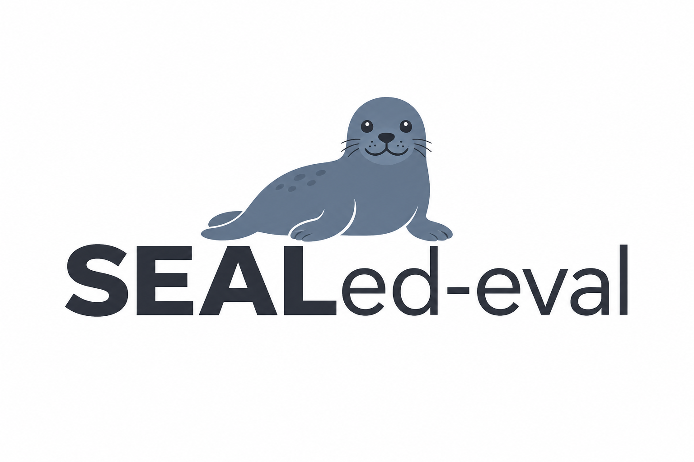
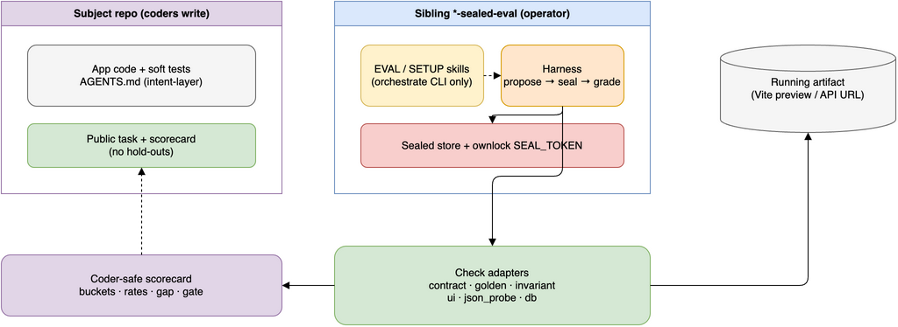
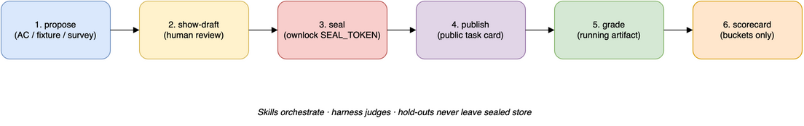

# SEALed-eval



**Agents will edit tests to pass. SEALed-eval keeps the grade outside their reach.**

SEALed-eval (SE) is a sealed evaluation control plane for coding agents. It lives in its **own repo/process**, drafts and seals hold-out cases, publishes a **public task** to coder agents, then grades a **running artifact**. Coders never see hold-out payloads.

Skills orchestrate; the harness judges.





Editable sources: [architecture.drawio](docs/architecture.drawio), [operator-loop.drawio](docs/operator-loop.drawio).

1. **Seeds draft; seal grades.** Markdown AC / fixtures invent *draft* cases. Only a human seal token makes them authoritative.
2. **Check modes** hit the artifact (HTTP, golden, invariants, Playwright UI, JSON probes, read-only SQL).
3. **Coder sees** public task + aggregate scorecard — never sealed expects.
4. **Secrets:** prefer `ownlock run -- sealed-eval …` and `./scripts/bootstrap.sh`.
5. **Sibling control plane:** `./scripts/bootstrap-sibling.sh /path/to/subject` → `{name}-sealed-eval`.

## Check modes

| Mode | What it does | Status |
| --- | --- | --- |
| `contract` | HTTP request + assert response | Works |
| `holdout_golden` | Sealed expected body / sha256 | Works |
| `invariant` | regex / never_contains / dotted jsonpath | Works |
| `ui` | Playwright text/selector/screenshot hash | Works (`[ui]`) |
| `json_probe` | Sealed argv → JSON stdout asserts | Works |
| `db` | Read-only SQL via `DATABASE_URL` | Works (sqlite; psycopg optional) |
| `differential` / `cli` | Specced | Later |

## Quick start

```bash
git clone https://github.com/thebscolaro/sealed-eval && cd sealed-eval
./scripts/bootstrap.sh
./scripts/dogfood-install-path.sh
```

For a subject app:

```bash
./scripts/bootstrap-sibling.sh ~/code/my-app
# then in the sibling repo: propose → seal → grade the running Vite/API URL
```

Cursor project skills: `.cursor/skills/` (symlinked from `distribution/cursor-plugin/skills/`).

## Docs

- [Runbook](docs/RUNBOOK.md) · [SPEC.md](SPEC.md) · [AGENTS.md](AGENTS.md) · [CHANGELOG.md](CHANGELOG.md) · [github-security](docs/github-security.md)
- Dogfoods: [SPA](docs/dogfood-spa.md) · [fullstack](docs/dogfood-fullstack.md) · [plugin + sandbox](docs/dogfood-plugin-sandbox.md)
- Local Cursor plugin: `./scripts/install-cursor-plugin-local.sh` → `~/.cursor/plugins/local/sealed-eval`

MIT. Keep seal tokens out of issues and CI logs.
